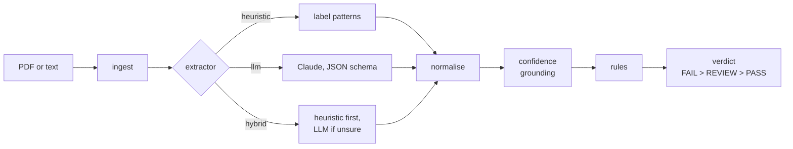

# AI Document Validator

Extracts structured fields from supplier invoices (PDF or text), checks them against configurable business
rules and returns `PASS`, `FAIL` or `REVIEW` — with the evidence behind every value, so a reviewer can trust
or dispute the result.

**The idea in one line:** the LLM only *proposes* values; everything that *decides* — normalisation,
confidence, rules and the verdict — is deterministic code that checks each value against the document.
When the model is wrong, the result is a `REVIEW` for a person, not a wrong `PASS` or `FAIL`.

**Result on the held-back test split** (80 invoices, six sources, run once with code and prompt frozen):
Claude Opus 5 extracts **98% of fields** correctly and agrees with the expected verdict on **95%** of
invoices, at **$0.034** and ~7 s per invoice (p95 10.9 s). The free heuristic scores 50% and 55%. **No
invoice got a wrong `PASS` or `FAIL`**: the four disagreements are all `REVIEW`s, where the system was unsure
and asked for a person.

## How this answers the brief

| What the brief values | What we did | Where to check |
|---|---|---|
| **Judgment** — heuristic vs LLM vs hybrid, and why | All three behind one interface, measured on the same 160 invoices. The heuristic is free but reads only the layouts it was written for; the hybrid saves calls only on known templates; the LLM is needed for varied layouts. Model chosen by a rule written before seeing results | [Evaluation](#evaluation), [When not to use an LLM](#cost-latency-and-risk) |
| **Production mindset** — contracts, failure modes, observability, cost/latency | Typed Pydantic contracts; timeouts, retries and a fallback to the heuristic when the LLM fails; JSON logs with request id, latency, model and verdict; cost and latency measured per document; prompt caching; a hard cap on paid calls | [API](#api), [Cost, latency and risk](#cost-latency-and-risk) |
| **Extraction + rules design** — extensibility, typing, failure handling | Rules are small classes behind a `Protocol`: adding one is a class and a line. Confidence comes from checking evidence against the document, never from the model | [Architecture](#architecture), [docs/decisions.md](docs/decisions.md) |
| **Evaluation mindset** — golden set quality, metrics honesty | 160 invoices from six sources the author did not write, labels checked against the printed PDF, a dev half for fixing and a test half run once. Every metric per source; failures printed | [Evaluation](#evaluation), [docs/evaluation.md](docs/evaluation.md), [docs/data.md](docs/data.md) |
| **AI-assisted engineering** — deliberate use, ownership, accepted/rejected | What each tool did, what the author decided, what was rejected and why | [AI_USAGE.md](AI_USAGE.md) |
| **Communication** — a README a teammate can run and challenge in 15 minutes | This page: run it, see the numbers, read the trade-offs. Details are one link away | — |
| **Craft** — clean Python, tests that protect behaviour | ruff, type hints, ~240 tests including every LLM failure mode through a fake transport; CI runs lint, tests, a quality gate and the Docker image | [Testing](#testing) |

## Architecture



**Why this shape.** A compliance verdict must be auditable, and an LLM is not. So the model is used for
the one thing it is good at — reading a messy, unknown layout — and everything it returns is checked by
code: the evidence must be in the document and must contain the value, or the field drops to low
confidence and the verdict to `REVIEW`. The same checks apply to all three extractors, which is what makes
them comparable. We rejected the simpler alternative (let the model return the verdict) because it cannot
be tested or explained, and the more elaborate ones (agents, several models voting, a vector store) because
nothing in the brief needs them.

| Step | What it does | Deterministic |
|---|---|---|
| ingest | PDF (text layer, via `pypdf`) or UTF-8 text → pages; the original PDF is kept | yes |
| extractor | proposes a raw value and an evidence snippet per field. The LLM receives the PDF itself (so it sees the layout) plus our extracted text, and must quote the text | heuristic yes, LLM no |
| normalise | dates → ISO, amounts → `Decimal`, currency → ISO 4217, tax ids → canonical | yes |
| confidence | checks the evidence is in the document and supports the value | yes |
| rules | seven independent rules, each `PASS` / `FAIL` / `REVIEW` with a message | yes |

The LLM sits behind a two-level boundary: a **transport** that only moves text (real Anthropic client, a
recorded-response replayer, or a test double) and a **typed layer** that parses, validates and grounds the
answer. That split is what makes timeouts, rate limits and malformed model output testable. If the LLM
fails, the pipeline falls back to the heuristic and says so in the response.

Code map: `src/validator/` — `api.py` (HTTP), `pipeline.py` (orchestration), `ingest.py`, `heuristic.py`,
`llm.py` + `transport.py` + `prompts.py` (LLM path), `hybrid.py`, `normalize.py`, `confidence.py`,
`rules.py`, `models.py` (contracts), `observability.py` (JSON logs).

## Quick start

Requires Python 3.12+.

```bash
python -m venv .venv
.venv/Scripts/activate            # Windows (Git Bash); on macOS/Linux: source .venv/bin/activate
pip install -e ".[dev]"
cp .env.example .env              # defaults run fully offline
uvicorn validator.api:create_app --factory --port 8000
```

Open <http://localhost:8000/docs> for the interactive OpenAPI schema.

With Docker instead: `docker compose up --build` (the image is built and health-checked in CI).

### Configuration

| Variable | Default | Meaning |
|---|---|---|
| `EXTRACTOR` | `heuristic` | `heuristic`, `llm` or `hybrid` |
| `LLM_MODEL` | `claude-opus-5` | Claude model for `llm` / `hybrid` |
| `LLM_TRANSPORT` | `replay` in `.env.example` (`live` if unset) | `replay` uses recorded responses (no key); `live` calls the API |
| `ANTHROPIC_API_KEY` | empty | only needed with `LLM_TRANSPORT=live` |
| `LLM_TIMEOUT_S` | `30` | per-request timeout; the SDK retries 408/409/429/5xx twice |
| `LLM_INPUT` | `pdf` | `pdf` also sends the original PDF so the model sees the page layout; `text` sends only the extracted text. Evidence is always checked against the extracted text ([measured](docs/evaluation.md#8-how-the-document-reaches-the-model)) |
| `PDF_TEXT` | `plain` | `plain` or `layout` text extraction from the PDF |
| `LOG_LEVEL` | `INFO` | JSON logs to stdout, one line per request |

Invalid combinations fail at start-up with a clear message (for example `EXTRACTOR=llm` with
`LLM_TRANSPORT=live` and no key).

## API

| Method | Path | Body | Returns |
|---|---|---|---|
| `POST` | `/v1/validate` | JSON or multipart: document + rule config | extraction + rule results + verdict |
| `POST` | `/v1/extract` | JSON or multipart: document only | extraction |
| `GET` | `/health` | — | liveness |

JSON body: `{"document": {"text": "..."} | {"content_base64": "...", "media_type": "application/pdf"}, "config": {...}, "reference_date": "YYYY-MM-DD"}`.
Multipart: a `file` part, a `config` part holding the JSON config, and an optional `reference_date`.
`reference_date` defaults to today; the invoice age rule is measured against it.

```bash
curl -s -X POST localhost:8000/v1/validate \
  -F "file=@evals/golden/inv_10_pdf.pdf;type=application/pdf" \
  -F 'config={"document_type":"SUPPLIER_INVOICE","max_age_days":90,"allowed_currencies":["EUR","GBP"],"required_fields":["supplier_name","invoice_number","invoice_date","total_amount"]}' \
  -F "reference_date=2026-06-30"
```

### Rule config

| Field | Required | Meaning |
|---|---|---|
| `document_type` | yes | `SUPPLIER_INVOICE` |
| `max_age_days` | yes | the invoice date must be within this many days before `reference_date` |
| `allowed_currencies` | no | ISO 4217 codes; missing currency → `REVIEW` |
| `required_fields` | no | fields that must be present |
| `expected_customer_tax_id` | no | the invoice must be addressed to this tax id (`ESB12345678` equals `B12345678`) |

### Sample request and response

Request (the invoice text is `evals/golden/inv_06_traps.txt`: the customer block comes before the
supplier, a due date before the issue date, and a subtotal and VAT line before the total):

```json
{
  "document": {"text": "TAX INVOICE\n\nBill to:\nNorthwind Construction S.L.\n..."},
  "reference_date": "2026-06-30",
  "config": {
    "document_type": "SUPPLIER_INVOICE",
    "max_age_days": 90,
    "allowed_currencies": ["EUR", "GBP"],
    "required_fields": ["supplier_name", "invoice_number", "invoice_date", "total_amount"]
  }
}
```

Response (abridged to 3 of the 10 fields; headers include `X-Request-ID`):

```json
{
  "request_id": "demo-0001",
  "status": "PASS",
  "extractor_used": "heuristic",
  "reference_date": "2026-06-30",
  "warnings": [],
  "llm": null,
  "rules": [
    {"id": "invoice_date_max_age", "passed": true, "status": "PASS", "message": "invoice_date is 29 days old (max 90)"},
    {"id": "total_amount_positive", "passed": true, "status": "PASS", "message": "total_amount 4114.00 is greater than 0"},
    {"id": "supplier_name_present", "passed": true, "status": "PASS", "message": "supplier_name is 'Delta Hydraulics B.V.'"},
    {"id": "currency_allowed", "passed": true, "status": "PASS", "message": "currency EUR is allowed"},
    {"id": "required_fields_present", "passed": true, "status": "PASS", "message": "all required fields present"},
    {"id": "amounts_consistent", "passed": true, "status": "PASS", "message": "subtotal 3400.00 + tax 714.00 = total 4114.00"}
  ],
  "extraction": {
    "supplier_name": {"value": "Delta Hydraulics B.V.", "confidence": 1.0, "evidence": "Delta Hydraulics B.V.", "page": 1},
    "total_amount": {"value": 4114.0, "confidence": 1.0, "evidence": "Amount due:      4,114.00 EUR", "page": 1},
    "customer_tax_id": {"value": "ESB12345678", "confidence": 1.0, "evidence": "VAT: ESB12345678", "page": 1}
  }
}
```

When an LLM was used, `llm` carries `model`, `latency_ms`, `input_tokens`, `output_tokens`,
`estimated_cost_usd` and whether the response was replayed from a recording.

Errors never expose stack traces:

```json
{"error": {"code": "invalid_request", "message": "request body does not match the schema",
  "details": [{"type": "greater_than", "loc": ["config", "max_age_days"], "msg": "Input should be greater than 0"}]}}
```

| Status | Code | When |
|---|---|---|
| 413 | `document_too_large` | document over 5 MB |
| 415 | `unsupported_media_type` | neither JSON nor multipart, or a non-PDF/non-text file |
| 422 | `invalid_request` | body or config does not match the schema |
| 422 | `unreadable_document` | PDF without a text layer (scans need OCR, which is out of scope) |

## Evaluation

```bash
python -m evals.run --extractor heuristic          # dev and test splits, broken down by source
python -m evals.run --all                           # heuristic, three Claude models, hybrid
python -m evals.run --all --check-baseline          # the CI quality gate
```

160 invoices from six sources the author did not write, chosen to avoid tuning to one template: a US
template (Mendeley), German e-invoices (Mustang), Spanish electricity bills (IDSEM), Gulf invoices in AED and
KWD (SalorWorks), 13 countries from an e-invoicing library (GOBL) and a held-out set of deliberately messy
European layouts. 18 countries, 12 currencies, 6 label languages; credit notes, multi-page and multi-rate
invoices. Every label was checked against the printed PDF. Each source is split 50/50 into **dev** (failures
inspected and fixed) and **test** (run once, at the end, with code and prompt frozen). Invoices written by
the author are excluded from every metric.

What the data covers and how it was built: [docs/data.md](docs/data.md). Method, experiments and the
contamination log: [docs/evaluation.md](docs/evaluation.md).

**Test split, run once** (80 invoices; the chosen configuration and the free alternatives):

| Configuration | Field exact match | Verdict agreement | Wrong `PASS`/`FAIL` | LLM calls | Cost / invoice |
|---|---|---|---|---|---|
| Heuristic | 50% | 55% | 34 wrong `FAIL`, 0 wrong `PASS` | 0 | $0 |
| **LLM — Opus 5, PDF + text, prompt v4b** | **98%** | **95%** | **0** | 80 | $0.034 |
| Hybrid — heuristic first, Opus 5 when unsure | 98% | 96% | 0 | 80 | $0.034 |

Opus 5 per source on test: Mendeley 100% verdicts, Mustang 100%, IDSEM 93%, SalorWorks 100%, GOBL 77%,
held-out 100%. On dev the three models were compared first and a rule written in advance picked Opus 5
(Haiku 4.5 and Sonnet 5 were more than 3 points behind on verdicts); four prompt variants were compared on
dev before the test run. Details: [docs/evaluation.md](docs/evaluation.md).

The hybrid called the LLM on all 80 invoices: on varied layouts the heuristic is never sure of every field,
so it saves nothing here. It would on a stream of a few known templates.

## Cost, latency and risk

**When would we not use an LLM?**

- **When the invoice carries its own data.** E-invoices such as ZUGFeRD / Factur-X (the Mustang source) embed
  an EN 16931 XML with every field. Reading that XML is exact, free and instant; an LLM there only adds cost
  and risk.
- **When the stream is a few known, clean templates.** The heuristic costs nothing and takes ~0.1 s; the
  hybrid mode calls the LLM only when the heuristic is unsure. On our deliberately varied data the heuristic
  was never sure (the hybrid called the LLM on every invoice), so it only pays off on a narrow stream —
  measure the share of `hybrid:heuristic_only` responses before relying on it.
- **When the document cannot leave the premises**, or a sub-second synchronous answer is required.

**What did we measure?** Per invoice, on the test split with the chosen configuration (Opus 5, PDF + text,
prompt v4b):

| | Mean | p95 |
|---|---|---|
| Latency, LLM call (PDF + text) | 7.0 s | 10.9 s |
| Latency, heuristic only (PDF parsing included) | 0.11 s | 0.44 s |
| Cost per invoice, Opus 5 | $0.034 | $0.069 on the 2–4-page utility bills |
| Cost per 1,000 invoices, Opus 5 | ~$34 | |

The whole evaluation — every model, prompt variant and input experiment, 661 recorded calls — cost about
$9.40 in API usage.

On dev, the same measurement for the cheaper models: Haiku 4.5 costs about 1/4.5 of Opus per invoice
(~$0.0076) and Sonnet 5 ~$0.014. With the tuned prompt Haiku extracts 99% of dev fields correctly, but it
sends more invoices to `REVIEW` than Opus (81% verdict agreement on dev, against 90% for Opus with the
earlier prompt) ([evaluation §7 and §9](docs/evaluation.md)). Prompt caching of the instructions saves
~22% per invoice on Opus and Sonnet (measured: cache hits on 66 of 67 calls). For bulk, non-urgent
processing the Batch API would halve the price again. The heuristic path costs nothing and takes 0.11 s on
average, PDF parsing included.

**What would we monitor in production?**

| Signal | Why | Where it comes from |
|---|---|---|
| `REVIEW` rate, per customer and per supplier | the real cost of the system is the people reviewing; a jump means a new layout or a model change | verdict in the JSON log |
| Share of fields that fail grounding (confidence 0.3) | the model saying things the document does not say: hallucination or a broken text layer | per-field confidence |
| Share of `FAIL` per rule | a business signal (old invoices, wrong currency), and a sanity check when it moves suddenly | rule results |
| LLM errors, fallbacks, p95 latency | provider incidents, timeouts, rate limits | `extractor_used`, latency in the log |
| Cost per invoice, tokens, cache hit rate | spend drifts when documents get longer or caching breaks | `usage` returned by the API |
| A weekly sample of `PASS` invoices checked by a person | the only way to catch a wrong `PASS`, which the system cannot see by itself | review queue |

Every model call is logged with the model id and the prompt version, so a change in any of these can be tied
to a deploy. Before changing model or prompt, the evaluation set is re-run and the CI quality gate blocks a
regression.

## Design decisions and trade-offs

Every decision — problem, choice, evidence, what we rejected and when we would revisit it — is in
[docs/decisions.md](docs/decisions.md), starting with a one-page table. The ones that matter most:

- **The model sees the PDF, not only extracted text** — PDF text extraction loses the layout; sending the page
  as well raised dev verdict agreement from 74% to 94% on Haiku for +57% cost. Evidence must still quote our
  text, so every value stays checkable ([measured](docs/evaluation.md#8-how-the-document-reaches-the-model)).
- **Model chosen by a rule written before the results** — the cheapest model within 3 points of the best.
- **Prompt chosen by a controlled experiment**, not by intuition: four variants on the same dev invoices; an
  instruction that sounded helpful made dates worse, and forcing the model to state the issuer's country and
  date format first fixed them ([measured](docs/evaluation.md#9-prompt-variants)).
- **Finance rules, still verified** — credit notes are booked negative, and a tax total may be the sum of
  printed per-rate lines, trusted only when subtotal + tax = total.
- **Structured output validated by us, not by the SDK helper** — so corrupt model output can be simulated
  and tested, and responses recorded and replayed.
- **Confidence from grounding, in four discrete levels** — model self-confidence is not calibrated; a value
  must be found in the document to count.
- **`REVIEW` means "not sure", `FAIL` means "the document breaks a rule"** — a missing field fails; a doubtful
  one goes to a person. A subtotal + tax ≠ total mismatch is `REVIEW`, because withholdings such as Spanish
  IRPF legitimately cause it.
- **Rules as small independent classes** — adding one is a class and a line; no registry or DSL.
- **Graceful degradation** — if the LLM fails, the heuristic answers and the response says so.
- **No server-side model fallback and no sampling parameters** — the model in the response is always the
  one that answered; stability comes from schema-constrained output and recordings.

## Assumptions

The brief leaves these open; each is documented with its alternatives in [docs/decisions.md](docs/decisions.md).

- Only `SUPPLIER_INVOICE` is supported; other types are rejected with a clear error.
- PDFs must have a text layer; scanned PDFs are rejected (OCR is out of scope).
- `max_age_days` is measured against `reference_date` (default today), inclusive; a future date fails.
- Numeric dates follow the issuer's convention: a US address means month-first, European signals mean
  day-first; with no signal a date like `04/08/2026` is ambiguous and goes to `REVIEW`.
- Amounts accept European, English, Swiss and space-grouped separators; a lone `1.500` is ambiguous and
  lowers confidence, except in three-decimal currencies such as KWD.
- Credit notes are negative, even when printed without a minus sign; corrective invoices keep their sign.
- The tax total may be the sum of the printed per-rate tax lines when no total line is printed.
- A missing currency when `allowed_currencies` is set gives `REVIEW`, not `FAIL`.
- `required_fields` is a rule of its own; overlapping rules each report independently.

## Data handling

The document is sent to the LLM provider only in `llm` and `hybrid` modes: by default the PDF itself plus
its extracted text, because seeing the page measurably improves extraction; `LLM_INPUT=text` sends only the
text. Logs record the request id, latency, extractor, model, token counts, verdict, and the
document's length and a hash — never its content. No keys in the repository; `.env` is ignored. In
production: a data processing agreement with the provider, zero-retention where available, and EU
inference.

## Limitations and next steps

- **No OCR**: scanned invoices are rejected. The model could read them from the image, but nothing could
  check what it read. Next: OCR to produce a checkable text layer; the rest of the pipeline stays.
- **Scrambled text layers cost reviews**: in the Spanish utility bills the PDF text puts labels and amounts
  in separate blocks, so the model's evidence often cannot be found verbatim and the invoice goes to
  `REVIEW`. The answer is safe but not automated. Next: match evidence by position, not only by text.
- **Heuristics are layout-bound**: they work on the layouts they were written for; the hybrid therefore
  saves calls only on streams dominated by known templates.
- **The prompt was tuned on the cheapest model**: variants were compared on Haiku and the winner applied to
  Opus, to stay within the API budget.
- **Coverage gaps**: no non-Latin label text that survives PDF extraction, no handwritten documents.
- **Evaluation data is synthetic**: freely licensed real invoices do not exist. Next: a labelled sample of
  real customer documents under a data processing agreement, with double labelling.
- **Confidence thresholds are not calibrated**: next, fit them against labelled production data.
- **Tax ids are checked for format, not validity**: next, checksum validation per country and a VIES lookup.
- **One document type**: next, certificates and registration extracts with their own field schemas.

## Testing

```bash
pytest -q
```

No test can reach the real API: a fixture removes the key, and LLM behaviour — timeouts, rate limits,
malformed or truncated JSON, refusals, hallucinated values, fallback — is driven through a fake transport.
Rules, normalisation, the heuristic, the hybrid cascade, the HTTP API (JSON and multipart, errors, OpenAPI)
and the evaluation metrics each have their own test file.

## AI usage

How AI assistants were used, what was rejected and why, and the extraction prompt: [AI_USAGE.md](AI_USAGE.md).

## Data attribution

Public evaluation invoices: Kozłowski, M.; Weichbroth, P. (2021), *Samples of electronic invoices*, Mendeley
Data, V2, doi:10.17632/tnj49gpmtz.2, licensed under
[CC BY 4.0](https://creativecommons.org/licenses/by/4.0/); labels derived from
[katanaml-org/invoices-donut-data-v1](https://huggingface.co/datasets/katanaml-org/invoices-donut-data-v1)
(MIT). Details and changes: `evals/external/mendeley/LICENSE-DATA.txt`.

Also used, each with its own `LICENSE-DATA.txt` under `evals/external/`:
- IDSEM, *Invoices Database of the Spanish Electricity Market* (Zenodo 6373179), CC BY 4.0.
- Mustang project test invoices (github.com/ZUGFeRD/mustangproject), Apache-2.0.
- Synthetic Shopify Invoice Test Pack by Salorworks (github.com/SalorWorks/shopify-invoice-test-pack),
  CC BY 4.0.
