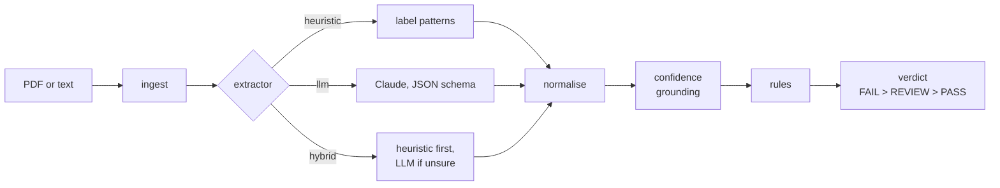

# AI Document Validator

Extracts structured fields from supplier invoices (PDF or text), checks them against configurable business
rules and returns `PASS`, `FAIL` or `REVIEW` — with the evidence behind every value, so a reviewer can trust
or dispute the result.

**The idea in one line:** the LLM only *proposes* values; everything that *decides* — normalisation,
confidence, rules and the verdict — is deterministic and auditable.

- **Three extraction modes** behind one interface: a free heuristic, an LLM (Claude), and a hybrid that calls
  the LLM only when the heuristic is unsure. All three are measured on the same data.
- **Confidence you can audit:** a value scores 1.0 only if its evidence appears verbatim in the document and
  actually contains the value. A hallucinated value drops to 0.3 and the verdict becomes `REVIEW`.
- **Honest evaluation:** third-party public invoices plus an independently written held-out set, split into a
  dev half and a test half nobody looks at. See [docs/evaluation.md](docs/evaluation.md).
- **Runs offline:** no API key needed. LLM results replay from recorded responses.

<!-- FILL AFTER RECORDING: one-line headline result (best configuration on the test split). -->

## Architecture



| Step | What it does | Deterministic |
|---|---|---|
| ingest | PDF (text layer, via `pypdf`) or UTF-8 text → pages | yes |
| extractor | proposes a raw value and an evidence snippet per field | heuristic yes, LLM no |
| normalise | dates → ISO, amounts → `Decimal`, currency → ISO 4217, tax ids → canonical | yes |
| confidence | checks the evidence is in the document and supports the value | yes |
| rules | seven independent rules, each `PASS` / `FAIL` / `REVIEW` with a message | yes |

The LLM sits behind a two-level boundary: a **transport** that only moves text (real Anthropic client, a
recorded-response replayer, or a test double) and a **typed layer** that parses, validates and grounds the
answer. That split is what makes timeouts, rate limits and malformed model output testable. If the LLM
fails, the pipeline falls back to the heuristic and says so in the response.

Code map: `src/validator/` — `api.py` (HTTP), `pipeline.py` (orchestration), `ingest.py`, `heuristic.py`,
`llm.py` + `transport.py` + `prompts.py` (LLM path), `hybrid.py`, `normalize.py`, `confidence.py`,
`rules.py`, `models.py` (contracts), `observability.py` (JSON logs).

## Quick start

Requires Python 3.12+.

```bash
python -m venv .venv
.venv/Scripts/activate            # Windows (Git Bash); on macOS/Linux: source .venv/bin/activate
pip install -e ".[dev]"
cp .env.example .env              # defaults run fully offline
uvicorn validator.api:create_app --factory --port 8000
```

Open <http://localhost:8000/docs> for the interactive OpenAPI schema.

With Docker instead: `docker compose up --build` (the image is built and health-checked in CI).

### Configuration

| Variable | Default | Meaning |
|---|---|---|
| `EXTRACTOR` | `heuristic` | `heuristic`, `llm` or `hybrid` |
| `LLM_MODEL` | `claude-opus-5` | Claude model for `llm` / `hybrid` |
| `LLM_TRANSPORT` | `replay` in `.env.example` | `replay` uses recorded responses (no key); `live` calls the API |
| `ANTHROPIC_API_KEY` | empty | only needed with `LLM_TRANSPORT=live` |
| `LLM_TIMEOUT_S` | `30` | per-request timeout; the SDK retries 408/409/429/5xx twice |
| `LLM_INPUT` | `pdf` | `pdf` also sends the original PDF so the model sees the page layout; `text` sends only the extracted text. Evidence is always checked against the extracted text ([measured](docs/evaluation.md#8-how-the-document-reaches-the-model)) |
| `PDF_TEXT` | `plain` | `plain` or `layout` text extraction from the PDF |
| `LOG_LEVEL` | `INFO` | JSON logs to stdout, one line per request |

Invalid combinations fail at start-up with a clear message (for example `EXTRACTOR=llm` with
`LLM_TRANSPORT=live` and no key).

## API

| Method | Path | Body | Returns |
|---|---|---|---|
| `POST` | `/v1/validate` | JSON or multipart: document + rule config | extraction + rule results + verdict |
| `POST` | `/v1/extract` | JSON or multipart: document only | extraction |
| `GET` | `/health` | — | liveness |

JSON body: `{"document": {"text": "..."} | {"content_base64": "...", "media_type": "application/pdf"}, "config": {...}, "reference_date": "YYYY-MM-DD"}`.
Multipart: a `file` part, a `config` part holding the JSON config, and an optional `reference_date`.
`reference_date` defaults to today; the invoice age rule is measured against it.

```bash
curl -s -X POST localhost:8000/v1/validate \
  -F "file=@evals/golden/inv_10_pdf.pdf;type=application/pdf" \
  -F 'config={"document_type":"SUPPLIER_INVOICE","max_age_days":90,"allowed_currencies":["EUR","GBP"],"required_fields":["supplier_name","invoice_number","invoice_date","total_amount"]}' \
  -F "reference_date=2026-06-30"
```

### Rule config

| Field | Required | Meaning |
|---|---|---|
| `document_type` | yes | `SUPPLIER_INVOICE` |
| `max_age_days` | yes | the invoice date must be within this many days before `reference_date` |
| `allowed_currencies` | no | ISO 4217 codes; missing currency → `REVIEW` |
| `required_fields` | no | fields that must be present |
| `expected_customer_tax_id` | no | the invoice must be addressed to this tax id (`ESB12345678` equals `B12345678`) |

### Sample request and response

Request (the invoice text is `evals/golden/inv_06_traps.txt`: the customer block comes before the
supplier, a due date before the issue date, and a subtotal and VAT line before the total):

```json
{
  "document": {"text": "TAX INVOICE\n\nBill to:\nNorthwind Construction S.L.\n..."},
  "reference_date": "2026-06-30",
  "config": {
    "document_type": "SUPPLIER_INVOICE",
    "max_age_days": 90,
    "allowed_currencies": ["EUR", "GBP"],
    "required_fields": ["supplier_name", "invoice_number", "invoice_date", "total_amount"]
  }
}
```

Response (abridged to 3 of the 10 fields; headers include `X-Request-ID`):

```json
{
  "request_id": "demo-0001",
  "status": "PASS",
  "extractor_used": "heuristic",
  "reference_date": "2026-06-30",
  "warnings": [],
  "llm": null,
  "rules": [
    {"id": "invoice_date_max_age", "passed": true, "status": "PASS", "message": "invoice_date is 29 days old (max 90)"},
    {"id": "total_amount_positive", "passed": true, "status": "PASS", "message": "total_amount 4114.00 is greater than 0"},
    {"id": "supplier_name_present", "passed": true, "status": "PASS", "message": "supplier_name is 'Delta Hydraulics B.V.'"},
    {"id": "currency_allowed", "passed": true, "status": "PASS", "message": "currency EUR is allowed"},
    {"id": "required_fields_present", "passed": true, "status": "PASS", "message": "all required fields present"},
    {"id": "amounts_consistent", "passed": true, "status": "PASS", "message": "subtotal 3400.00 + tax 714.00 = total 4114.00"}
  ],
  "extraction": {
    "supplier_name": {"value": "Delta Hydraulics B.V.", "confidence": 1.0, "evidence": "Delta Hydraulics B.V.", "page": 1},
    "total_amount": {"value": 4114.0, "confidence": 1.0, "evidence": "Amount due:      4,114.00 EUR", "page": 1},
    "customer_tax_id": {"value": "ESB12345678", "confidence": 1.0, "evidence": "VAT: ESB12345678", "page": 1}
  }
}
```

When an LLM was used, `llm` carries `model`, `latency_ms`, `input_tokens`, `output_tokens`,
`estimated_cost_usd` and whether the response was replayed from a recording.

Errors never expose stack traces:

```json
{"error": {"code": "invalid_request", "message": "request body does not match the schema",
  "details": [{"type": "greater_than", "loc": ["config", "max_age_days"], "msg": "Input should be greater than 0"}]}}
```

| Status | Code | When |
|---|---|---|
| 413 | `document_too_large` | document over 5 MB |
| 415 | `unsupported_media_type` | neither JSON nor multipart, or a non-PDF/non-text file |
| 422 | `invalid_request` | body or config does not match the schema |
| 422 | `unreadable_document` | PDF without a text layer (scans need OCR, which is out of scope) |

## Evaluation

```bash
python -m evals.run --extractor heuristic          # dev and test splits, broken down by source
python -m evals.run --all                           # heuristic, three Claude models, hybrid
python -m evals.run --all --check-baseline          # the CI quality gate
```

88 invoices from two sources the author did not write — 72 public Mendeley invoices (CC BY 4.0, labels by a
third party, each verified against its PDF) and 16 layout-rich held-out invoices written by isolated agents —
split 50/50 into dev (inspected) and test (never inspected). Invoices written by the author are excluded
from every metric. Method, sources considered and rejected, label quality and the contamination log:
[docs/evaluation.md](docs/evaluation.md).

<!-- FILL AFTER RECORDING: comparison table (heuristic, 3 models, hybrid) on the test split, per source,
with field exact match, verdict agreement, LLM calls, mean/p95 latency and cost per document. -->

## Cost, latency and risk

<!-- FILL AFTER RECORDING: the three answers with measured numbers.
1. When would you not use an LLM?
2. Measured latency and cost per document.
3. What to monitor in production. -->

## Design decisions and trade-offs

The full log, with rejected alternatives, is in [docs/decisions.md](docs/decisions.md). The ones that matter
most:

- **Structured output validated by us, not by the SDK helper** — so corrupt model output can be simulated
  and tested, and responses recorded and replayed.
- **Confidence from grounding, in four discrete levels** — model self-confidence is not calibrated; a value
  must be found in the document to count.
- **`REVIEW` means "not sure", `FAIL` means "the document breaks a rule"** — a missing field fails; a doubtful
  one goes to a person. A subtotal + tax ≠ total mismatch is `REVIEW`, because withholdings such as Spanish
  IRPF legitimately cause it.
- **Rules as small independent classes** — adding one is a class and a line; no registry or DSL.
- **Graceful degradation** — if the LLM fails, the heuristic answers and the response says so.
- **No server-side model fallback and no sampling parameters** — the model in the response is always the
  one that answered; stability comes from schema-constrained output and recordings.

## Assumptions

The brief leaves these open; each is documented with its alternatives in [docs/decisions.md](docs/decisions.md).

- Only `SUPPLIER_INVOICE` is supported; other types are rejected with a clear error.
- PDFs must have a text layer; scanned PDFs are rejected (OCR is out of scope).
- `max_age_days` is measured against `reference_date` (default today), inclusive; a future date fails.
- Numeric dates are read day-first unless the document shows otherwise.
- Amounts accept European and English separators; a lone `1.500` is ambiguous and lowers confidence.
- A missing currency when `allowed_currencies` is set gives `REVIEW`, not `FAIL`.
- `required_fields` is a rule of its own; overlapping rules each report independently.

## Data handling

The document is sent to the LLM provider only in `llm` and `hybrid` modes: by default the PDF itself plus
its extracted text, because seeing the page measurably improves extraction; `LLM_INPUT=text` sends only the
text. Logs record the request id, latency, extractor, model, token counts, verdict, and the
document's length and a hash — never its content. No keys in the repository; `.env` is ignored. In
production: a data processing agreement with the provider, zero-retention where available, and EU
inference.

## Limitations and next steps

<!-- FILL AFTER RECORDING: adjust with the measured weaknesses. -->

- **No OCR**: scanned invoices are rejected.
- **Heuristics are layout-bound**: they work on the layouts they were written for (see the Mendeley results
  in [docs/evaluation.md](docs/evaluation.md)).
- **Evaluation data is synthetic**: freely licensed real invoices do not exist. Next: a labelled sample of
  real customer documents under a data processing agreement, with double labelling.
- **Confidence thresholds are not calibrated**: next, fit them against labelled production data.
- **Tax ids are checked for format, not validity**: next, checksum validation per country and a VIES lookup.
- **One document type**: next, certificates and registration extracts with their own field schemas.

## Testing

```bash
pytest -q
```

No test can reach the real API: a fixture removes the key, and LLM behaviour — timeouts, rate limits,
malformed or truncated JSON, refusals, hallucinated values, fallback — is driven through a fake transport.
Rules, normalisation, the heuristic, the hybrid cascade, the HTTP API (JSON and multipart, errors, OpenAPI)
and the evaluation metrics each have their own test file.

## AI usage

How AI assistants were used, what was rejected and why, and the extraction prompt: [AI_USAGE.md](AI_USAGE.md).

## Data attribution

Public evaluation invoices: Kozłowski, M.; Weichbroth, P. (2021), *Samples of electronic invoices*, Mendeley
Data, V2, doi:10.17632/tnj49gpmtz.2, licensed under
[CC BY 4.0](https://creativecommons.org/licenses/by/4.0/); labels derived from
[katanaml-org/invoices-donut-data-v1](https://huggingface.co/datasets/katanaml-org/invoices-donut-data-v1)
(MIT). Details and changes: `evals/external/mendeley/LICENSE-DATA.txt`.

Also used, each with its own `LICENSE-DATA.txt` under `evals/external/`:
- IDSEM, *Invoices Database of the Spanish Electricity Market* (Zenodo 6373179), CC BY 4.0.
- Mustang project test invoices (github.com/ZUGFeRD/mustangproject), Apache-2.0.
- Synthetic Shopify Invoice Test Pack by Salorworks (github.com/SalorWorks/shopify-invoice-test-pack),
  CC BY 4.0.
