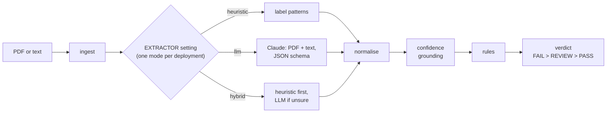

# AI Document Validator

Extracts structured fields from supplier invoices (PDF or text), checks them against configurable business
rules and returns `PASS`, `FAIL` or `REVIEW`, with the evidence behind every value, so a person can trust or
dispute the result.

**The idea in one line:** the LLM only *proposes* values; everything that *decides* — normalisation,
confidence, rules and the verdict — is deterministic code that checks each value against the document. When
the model is wrong, the invoice goes to a person (`REVIEW`); it does not get a wrong `PASS` or `FAIL`.

**Result on the test split** — 80 invoices from six independent sources, never used for tuning, run once
with code and prompt frozen:

- **With the LLM, no invoice got a wrong `PASS` or `FAIL`.** The 4 disagreements with the expected verdict
  are all `REVIEW`s.
- Claude Opus 5 extracts **98% of fields** correctly and agrees with the expected verdict on **95%** of
  invoices, at **$0.034** and ~7 s per invoice (p95 10.9 s).
- The free rule-based extractor scores 64% of fields and 55% of verdicts on the same invoices.

## How this answers the brief

| What the brief values | What we did | Where |
|---|---|---|
| **Judgment** — heuristic vs LLM vs hybrid | All three behind one interface, measured on the same invoices, with a recommendation for each. The heuristic was kept general on purpose, although template-specific rules scored better on our data. The model was chosen by a rule fixed before seeing results, the prompt by a side-by-side comparison on dev | [Which mode to use](#which-mode-to-use) |
| **Production mindset** | Typed contracts, timeouts and retries, fallback when the LLM fails, JSON logs, cost and latency measured per invoice, prompt caching, a hard cap on paid API calls | [Cost, latency and risk](#cost-latency-and-risk) |
| **Extraction + rules design** | Rules are small classes behind a `Protocol`; confidence comes from checking evidence against the document, never from the model | [Architecture](#architecture) |
| **Evaluation mindset** | 160 invoices: five third-party datasets and a stress set written by AI agents that never saw the code; every label checked against the printed PDF, a dev half for fixing and a test half run once, metrics per source, failures printed | [Evaluation](#evaluation) |
| **AI-assisted engineering** | What each tool did, the author's decisions and their reasons, what was rejected | [AI_USAGE.md](AI_USAGE.md) |
| **Craft** | ruff, type hints, 259 tests including every LLM failure mode; CI runs lint, tests, three quality gates and the Docker image | [Testing](#testing) |

## Architecture



**Why this shape.** A compliance verdict must be auditable, and an LLM is not. So the model does the one
thing it is good at — reading a messy, unknown layout — and code checks everything it returns. That check is
**grounding**: the model must quote, for each value, the text it read it from; the quote must appear in the
document's extracted text and must contain the value. If it does not, the field's confidence drops to 0.3
and any rule that depends on it returns `REVIEW`. The same checks apply to all three extractors, which is
what makes them comparable. Letting the model return the verdict was rejected as untestable; agents, model
ensembles or a vector store, because nothing in the brief needs them.

**Per-field confidence, our definition** (the same for every extractor, never reported by the model):

| Confidence | Meaning |
|---|---|
| 1.0 | grounded and unambiguous |
| 0.6 | grounded but ambiguous: a number such as `1.500`, a date that reads both ways, a tax total summed from printed lines that the totals do not yet confirm |
| 0.3 | not grounded (possible hallucination) or not parseable |
| 0.0 | not found |

Any rule that depends on a field below 1.0 returns `REVIEW`.

The three extractors do not run in parallel: a deployment uses one, chosen with `EXTRACTOR`.

### Which mode to use

| Mode | Use it when | Test result |
|---|---|---|
| **`llm`** (Claude Opus 5) | **Recommended for production**: suppliers and layouts vary | 98% fields, 95% verdicts, no wrong `PASS`/`FAIL`, $0.034 per invoice |
| `hybrid` | Most invoices come from a few known templates with rules written for them; the heuristic answers those for free | Same as `llm` on our data: the general heuristic was never sure of a whole invoice |
| `heuristic` | No API key or no network (the default, so the service runs offline), and as the automatic fallback when the LLM fails | 64% fields, 55% verdicts; it rejects valid invoices it cannot read and never passes a bad one |

The LLM sits behind two layers: a **transport** that only moves text (the Anthropic client, a replayer of
recorded responses, or a test double) and a **typed layer** that parses, validates and grounds the answer.
That split is what makes timeouts, rate limits and malformed model output testable.

Code map, `src/validator/`: `api.py` (HTTP), `pipeline.py`, `config.py`, `ingest.py`, `heuristic.py`,
`llm.py` + `transport.py` + `prompts.py` (LLM), `hybrid.py`, `extraction.py`, `normalize.py`,
`confidence.py`, `rules.py`, `models.py` (contracts), `pricing.py`, `observability.py` (JSON logs).

## Quick start

Requires Python 3.12+. No API key needed: LLM responses for the evaluation invoices are recorded in the
repository and replayed.

```bash
python -m venv .venv
.venv/Scripts/activate            # Windows (Git Bash); on macOS/Linux: source .venv/bin/activate
pip install -e ".[dev]"
cp .env.example .env              # defaults run fully offline
uvicorn validator.api:create_app --factory --port 8000
python -m evals.run --extractor heuristic   # the evaluation, offline (more commands below)
```

Replayed LLM responses exist only for the 160 evaluation invoices. With `EXTRACTOR=llm` and no API key,
any other document falls back to the heuristic, and the response says so in `extractor_used` and
`warnings`.

Open <http://localhost:8000/docs> for the OpenAPI schema. With Docker instead: `docker compose up --build`
(built and health-checked in CI).

| Variable | Default | Meaning |
|---|---|---|
| `EXTRACTOR` | `heuristic` | `heuristic`, `llm` or `hybrid` |
| `LLM_MODEL` | `claude-opus-5` | Claude model for `llm` / `hybrid` |
| `LLM_TRANSPORT` | `replay` in `.env.example` (`live` if unset) | `replay` uses recorded responses; `live` calls the API |
| `ANTHROPIC_API_KEY` | empty | only needed with `LLM_TRANSPORT=live` |
| `LLM_INPUT` | `pdf` | `pdf` sends the PDF itself plus our text, so the model sees the layout; `text` sends only the text |
| `PDF_TEXT` | `plain` | `plain` or `layout` text extraction |
| `LLM_TIMEOUT_S` | `30` | per-request timeout; the SDK retries 408/409/429/5xx twice |
| `LOG_LEVEL` | `INFO` | JSON logs to stdout |

Invalid combinations fail at start-up with a clear message (for example `EXTRACTOR=llm` with
`LLM_TRANSPORT=live` and no key).

## API

| Method | Path | Body | Returns |
|---|---|---|---|
| `POST` | `/v1/validate` | JSON or multipart: document + rule config | extraction + rule results + verdict |
| `POST` | `/v1/extract` | JSON or multipart: document only | extraction |
| `GET` | `/health` | — | liveness |

JSON body: `{"document": {"text": "..."} | {"content_base64": "...", "media_type": "application/pdf"},
"config": {...}, "reference_date": "YYYY-MM-DD"}`. Multipart: a `file` part, a `config` part holding the
JSON config, and an optional `reference_date` (defaults to today; the invoice age is measured against it).

```bash
curl -s -X POST localhost:8000/v1/validate -H "X-Request-ID: demo-0001" \
  -F "file=@evals/golden/inv_06_traps.txt;type=text/plain" \
  -F 'config={"document_type":"SUPPLIER_INVOICE","max_age_days":90,"allowed_currencies":["EUR","GBP"],"required_fields":["supplier_name","invoice_number","invoice_date","total_amount"]}' \
  -F "reference_date=2026-06-30"
```

Rule config: `document_type` (`SUPPLIER_INVOICE`), `max_age_days`, and optionally `allowed_currencies`,
`required_fields` and `expected_customer_tax_id` (the invoice must be addressed to this tax id).

### Sample request and response

The same request as JSON (the text of `evals/golden/inv_06_traps.txt`: the customer block comes before the supplier, a due
date before the issue date, a subtotal and VAT line before the total):

```json
{
  "document": {"text": "TAX INVOICE\n\nBill to:\nNorthwind Construction S.L.\n..."},
  "reference_date": "2026-06-30",
  "config": {
    "document_type": "SUPPLIER_INVOICE",
    "max_age_days": 90,
    "allowed_currencies": ["EUR", "GBP"],
    "required_fields": ["supplier_name", "invoice_number", "invoice_date", "total_amount"]
  }
}
```

Response (abridged to 3 of the 10 fields; headers include `X-Request-ID`):

```json
{
  "request_id": "demo-0001",
  "status": "PASS",
  "extractor_used": "heuristic",
  "reference_date": "2026-06-30",
  "warnings": [],
  "llm": null,
  "rules": [
    {"id": "invoice_date_max_age", "passed": true, "status": "PASS", "message": "invoice_date is 29 days old (max 90)"},
    {"id": "total_amount_positive", "passed": true, "status": "PASS", "message": "total_amount 4114.00 is greater than 0"},
    {"id": "supplier_name_present", "passed": true, "status": "PASS", "message": "supplier_name is 'Delta Hydraulics B.V.'"},
    {"id": "currency_allowed", "passed": true, "status": "PASS", "message": "currency EUR is allowed"},
    {"id": "required_fields_present", "passed": true, "status": "PASS", "message": "all required fields present"},
    {"id": "amounts_consistent", "passed": true, "status": "PASS", "message": "subtotal 3400.00 + tax 714.00 = total 4114.00"}
  ],
  "extraction": {
    "supplier_name": {"value": "Delta Hydraulics B.V.", "confidence": 1.0, "evidence": "Delta Hydraulics B.V.", "page": 1},
    "total_amount": {"value": 4114.0, "confidence": 1.0, "evidence": "Amount due:      4,114.00 EUR", "page": 1},
    "customer_tax_id": {"value": "ESB12345678", "confidence": 1.0, "evidence": "VAT: ESB12345678", "page": 1}
  }
}
```

Each rule reports `passed` (the brief's boolean) and `status`, which also carries `REVIEW` when the data was
too uncertain to decide. When an LLM was used, `llm` carries `model`, `prompt_version`, `latency_ms`, `input_tokens`,
`output_tokens`, `estimated_cost_usd` and whether the response was replayed. Errors never expose stack
traces: `413 document_too_large`, `415 unsupported_media_type`, `422 invalid_request` (with the validation
details), `422 unreadable_document` (a PDF without a text layer).

## Evaluation

```bash
python -m evals.run --extractor heuristic                                  # dev and test, offline
python -m evals.run --extractor llm --model claude-opus-5 --split test     # replays the headline run
python -m evals.run --extractor hybrid --model claude-opus-5 --split test
python -m evals.run --extractor llm --model claude-opus-5 --split test --check-baseline   # a CI gate
```

Each report gives field exact match, precision and recall per field, verdict agreement with a confusion
matrix, a breakdown per source and per difficulty, latency and cost, and prints the failures (on dev; test
failures stay hidden unless `--show-test-failures`).

**The evaluation set** (the brief's "golden set") is 160 invoices from six sources the author did not write,
chosen so that no single template dominates: a US invoice template, German e-invoices, Spanish electricity
bills, Gulf invoices in AED and KWD, e-invoicing examples from 14 countries, and a "stress set" of 16
deliberately messy European layouts written by Claude subagents that never saw the code. 18 countries, 12 currencies, 6 label languages, credit
notes, multi-page and multi-rate invoices. Every label was checked against the printed PDF. Each source is
split 50/50 into **dev** (failures inspected and fixed) and **test** (run once, at the end). The 14 invoices
in `evals/golden/` were written by the author and serve only as unit-test fixtures.

**Test split, run once:**

| Configuration | Field exact match | Verdict agreement | Wrong `PASS`/`FAIL` | LLM calls | Cost / invoice |
|---|---|---|---|---|---|
| Heuristic | 64% | 55% | 26 wrong `FAIL` (25 valid invoices rejected), 0 wrong `PASS` | 0 | $0 |
| **LLM — Opus 5, PDF + text, final prompt** | **98%** | **95%** | **0** | 80 | $0.034 |
| Hybrid — heuristic first, Opus 5 when unsure | 98% | 95% | 0 | 80 | $0.034 |

How the model, the input and the prompt were chosen on dev — three models, three ways of sending the
document, four prompt variants — and every result per source: [docs/evaluation.md](docs/evaluation.md).
What each data source adds and how it was built and licensed: [docs/data.md](docs/data.md).

## Cost, latency and risk

**When would we not use an LLM?**

- **When the invoice carries its own data.** E-invoices such as ZUGFeRD / Factur-X embed an XML with every
  field; reading it is exact, free and instant.
- **When most invoices come from a few known templates.** Rules written for them answer in ~0.1 s for
  nothing, and the hybrid calls the LLM only for the rest. We measured it: with rules for one frequent
  template, the hybrid skipped the LLM on 45% of test invoices at the same accuracy and cut the cost by a
  third. We did not ship those rules, because that template is also in our test data
  ([why](docs/decisions.md#b9--the-heuristic-stays-general-no-rules-learnt-from-one-template)).
- **When the document cannot leave the premises**, or a sub-second answer is required.

**What did we measure?** On the test split, chosen configuration:

| | Mean | p95 |
|---|---|---|
| Latency per invoice, LLM | 7.0 s | 10.9 s |
| Latency per invoice, heuristic (PDF parsing included, laptop) | 0.11 s | 0.44 s |
| Cost per invoice, Opus 5 | $0.034 | — (the 2–4-page utility bills average $0.069) |

About $34 per 1,000 invoices. Prompt caching of the instructions makes each Opus call ~24% cheaper
(measured). Claude Haiku 4.5 costs about a fifth as much; on dev, with the final prompt, it extracts 99% of
fields but agrees on fewer verdicts (81%); the Batch API would halve the price for non-urgent bulk runs. The whole
evaluation — every model, prompt and input experiment, 661 recorded calls — cost about $9.20.

**What would we monitor in production?**

| Signal | Why |
|---|---|
| `REVIEW` rate per customer and supplier | reviews are the real cost; a jump means a new layout or a model change |
| Share of fields that fail grounding | the model stating what the document does not say, or a broken text layer |
| `FAIL` rate per rule | a business signal, and a sanity check when it moves suddenly |
| LLM errors, fallbacks (`extractor_used`), p95 latency | provider incidents, timeouts, rate limits |
| Cost and tokens per invoice (`llm.estimated_cost_usd`, `input_tokens`, `output_tokens`) | spend drifts when documents grow or caching breaks |
| A weekly sample of `PASS` invoices checked by a person | the only way to catch a wrong `PASS`, which the system cannot see |

Every response and log line carries the model id and the prompt version, so a change can be tied to a
deploy; the CI quality gates block a regression before one.

## Key trade-offs

- **The model sees the PDF, not only its text.** Text extraction loses the layout; sending the page as well
  raised dev verdict agreement from 74% to 94% on Haiku for +57% cost. Evidence still has to quote our text,
  so every value stays checkable.
- **Review over automation.** Doubtful fields go to `REVIEW` rather than risk a wrong decision: 0 wrong
  `PASS`/`FAIL`, at the price of 4 reviews in 80.
- **A general heuristic over a better score.** Template-specific rules would have lifted the heuristic from
  55% to 78% of verdicts on test — by learning our own data. We kept it general.
- **Accounting rules, still verified.** Credit notes are booked negative and a tax total may be the sum of
  the printed per-rate lines, as a finance team books them; the sum is trusted only when subtotal + tax =
  total.
- **The most accurate model by a rule fixed in advance**, not by price or by taste: the cheapest model
  within 3 points of the best on dev.

Every decision — problem, choice, evidence, rejected alternatives, when to revisit — is in
[docs/decisions.md](docs/decisions.md), starting with a one-page table.

## Assumptions

- Only `SUPPLIER_INVOICE`; other document types are rejected with a clear error.
- PDFs need a text layer; scans are rejected (OCR is out of scope).
- `max_age_days` counts back from `reference_date` (default today), inclusive; a future date fails.
- Numeric dates follow the issuer's convention (a US address means month-first); with no signal, a date
  like `04/08/2026` is ambiguous and goes to `REVIEW`.
- A missing currency when `allowed_currencies` is set is `REVIEW`, not `FAIL`; `required_fields` is a rule of
  its own.

## Data handling

The document goes to the LLM provider only in `llm` and `hybrid` modes (by default the PDF plus its text).
Logs hold the request id, latency, extractor, model, tokens, verdict and a hash of the document, never its
content. No keys in the repository. In production: a data processing agreement, zero retention where
available, EU inference.

## What we would do with another day

1. **Re-run the model comparison with the final prompt.** It was tuned on the cheapest model; with it Haiku
   extracts 99% of dev fields, so Haiku at a fifth of the cost may now be the better trade.
2. **Match evidence by position, not only by text.** The Spanish utility bills print labels and amounts in
   separate blocks, so correct answers cannot be verified and go to `REVIEW`.
3. **OCR for scanned invoices,** producing a text layer the same checks can use.
4. **Calibrate confidence and validate tax ids** (checksums per country, VIES) on labelled customer data.

Not covered: invoices in non-Latin scripts, scans, handwriting, other document types, and real customer
documents (freely licensed real invoices do not exist, so the evaluation data is synthetic).

## Testing

```bash
pytest -q
```

259 tests. No test can reach the real API: a fixture removes the key, and every LLM failure mode —
timeouts, rate limits, malformed or truncated JSON, refusals, hallucinated values — is driven through a fake
transport. Rules, normalisation, the heuristic, the hybrid, the HTTP API (JSON and multipart, errors,
OpenAPI) and the evaluation metrics each have their own tests.

## AI usage

Which AI tools did what, the decisions the author took and why, what was rejected, and the extraction
prompt: [AI_USAGE.md](AI_USAGE.md).

## Data attribution

Evaluation invoices, each with its licence and changes in `evals/external/<source>/LICENSE-DATA.txt`, and a
rebuild script in `evals/sources/`:

- Kozłowski, M.; Weichbroth, P. (2021), *Samples of electronic invoices*, Mendeley Data, V2,
  doi:10.17632/tnj49gpmtz.2, CC BY 4.0; labels derived from
  [katanaml-org/invoices-donut-data-v1](https://huggingface.co/datasets/katanaml-org/invoices-donut-data-v1)
  (MIT).
- IDSEM, *Invoices Database of the Spanish Electricity Market* (Zenodo 6373179), CC BY 4.0.
- Mustang project test invoices (github.com/ZUGFeRD/mustangproject), Apache-2.0.
- Synthetic Shopify Invoice Test Pack by Salorworks (github.com/SalorWorks/shopify-invoice-test-pack),
  CC BY 4.0.
- GOBL and gobl.html examples by Invopop (github.com/invopop/gobl), Apache-2.0, rendered to PDF by this
  project.
